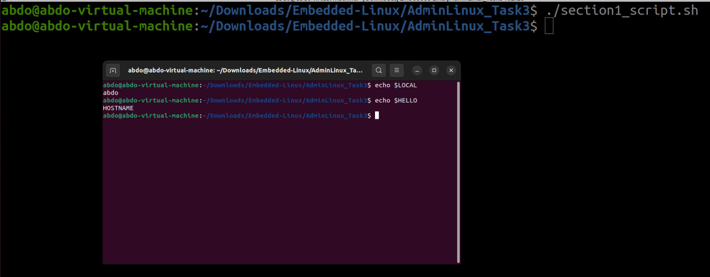

# Admin Linux — Task 3 (Submission)

Hello This task focuses on essential Linux administration and Bash scripting skills.
It includes two main sections designed to evaluate your ability to work with shell scripts, environment configuration, file operations, system navigation, and command-line utilities.

## Overview

Section 1: Create and execute a Bash script that checks for the existence of .bashrc, appends new environment variables (HELLO, LOCAL), and opens a new terminal session to demonstrate the result.

Section 2: A collection of Linux command exercises covering topics such as input/output redirection, editing user profiles, counting words and files, searching for files, listing inode numbers, and creating symbolic and hard links.

Each part of the task is supported by screenshots showing the terminal outputs as proof of successful execution.

---

## Section 1 — Bash script
- Script file: `section1_script.sh`
- the script was executed and the result is shown here.

Screenshot:  

---

## Section 2 — Questions and evidence screenshots

- Q1 — List user commands and redirect output:
    
  

- Q2 — Edit profile to display date at login and change prompt permanently:
  

- Q3 — Count words in a file / number of files in a directory:
  

- Q4 — What happens when executing:
  - a) `cat filename1 | cat filename2`  
    
  - b) `ls | rm`  
    
  - c) `ls /etc/passwd | wc -l`  
    

- Q5 — Search for files named `.profile`:
  

- Q6 — List inode numbers of `/`, `/etc`, `/etc/hosts`:
  

- Q7 — Create a symbolic link of `/etc/passwd` in `/boot`:
  

- Q8 — Create a hard link of `/etc/passwd` in `/boot` (explain why it may fail):
  

- Q9 — Behavior of `echo \` and PS2 prompt; changing PS2 from `>` to `:`:
- Note: PS2 is secondary prompt string
  

---

If you want me to:
- convert these relative image links to absolute GitHub URLs (so they still render if README is viewed from another branch), tell me which branch to target (for example `main` or `Task3_adminlinux`), and I will update the README with full blob URLs.
- or move all screenshots into a subfolder (e.g., `screenshots/`) and update links accordingly — I can prepare that change and the updated README.

Finished — the README now displays all uploaded screenshots inline so anyone opening the file can see the evidence of the work.
