# Admin Linux — Task 3 (Submission)

Hello — below are my answers and the screenshots that prove the outputs for each part of the task.
All screenshots have been uploaded to the repository and are embedded here so anyone who opens this README can view them.

Note: images are referenced by their filenames in this directory. If you moved the screenshots to a different folder, update the paths accordingly.

---

## Section 1 — Bash script
- Script file: `section1_script.sh`
- Proof (screenshot): the script was executed and the result is shown here.

Screenshot:  

---

## Section 2 — Questions and evidence screenshots

- Q1 — List user commands and redirect output:
  - Screenshot:  
  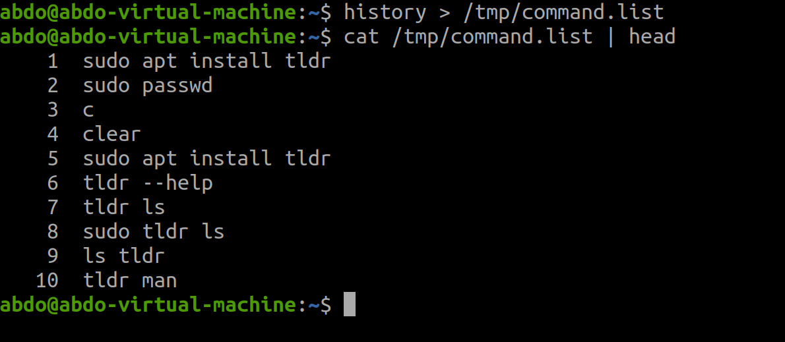

- Q2 — Edit profile to display date at login and change prompt permanently:
  - Screenshot:  
  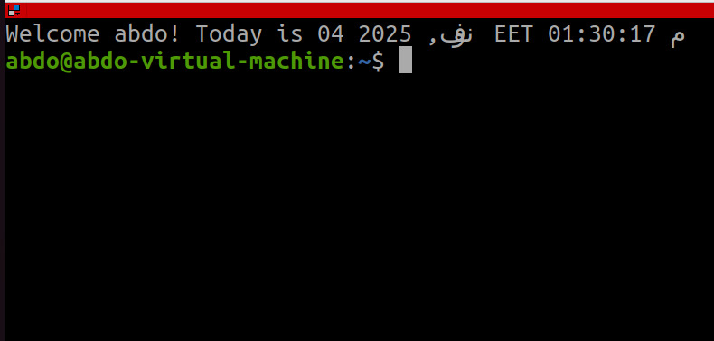

- Q3 — Count words in a file / number of files in a directory:
  - Screenshot:  
  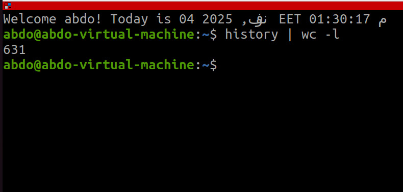

- Q4 — What happens when executing:
  - a) `cat filename1 | cat filename2`  
    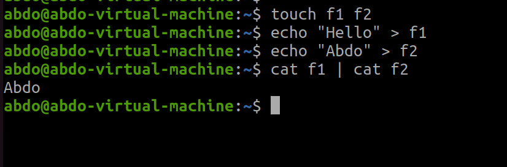
  - b) `ls | rm`  
    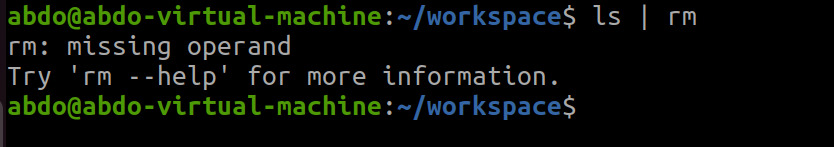
  - c) `ls /etc/passwd | wc -l`  
    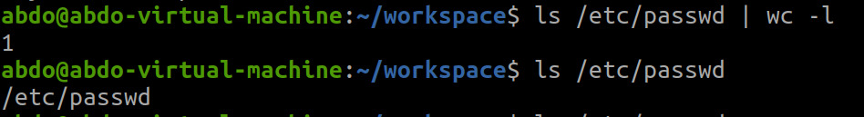

- Q5 — Search for files named `.profile`:
  - Screenshot:  
  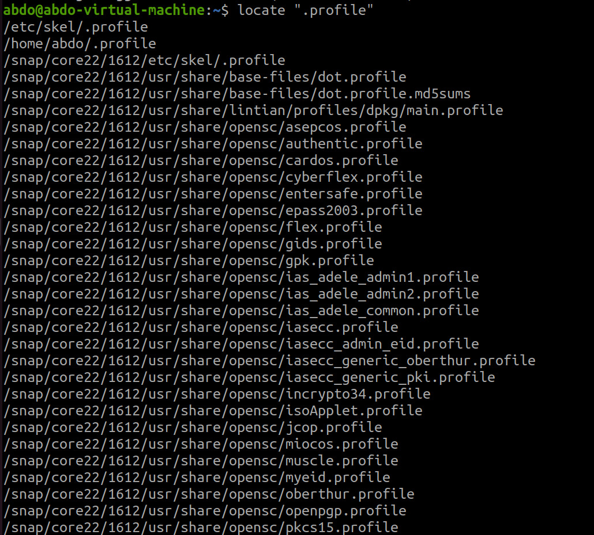

- Q6 — List inode numbers of `/`, `/etc`, `/etc/hosts`:
  - Screenshot:  
  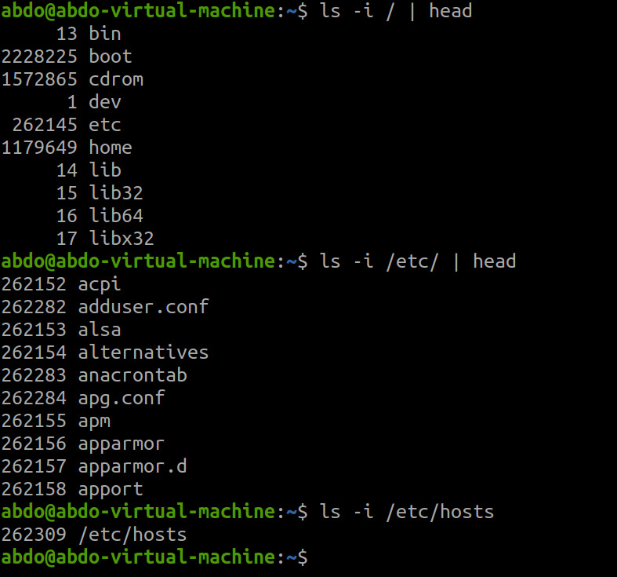

- Q7 — Create a symbolic link of `/etc/passwd` in `/boot`:
  - Screenshot:  
  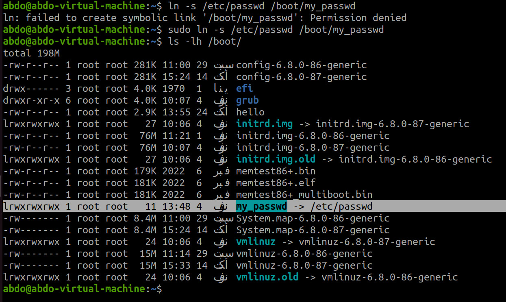

- Q8 — Create a hard link of `/etc/passwd` in `/boot` (explain why it may fail):
  - Screenshot:  
  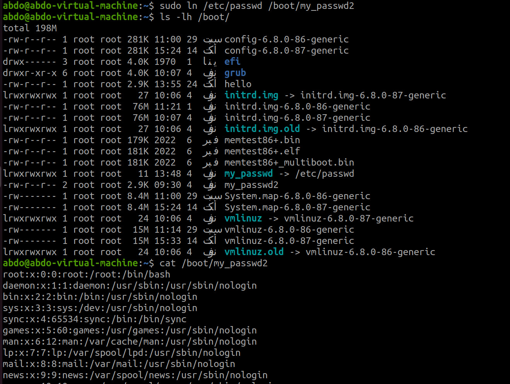

- Q9 — Behavior of `echo \` and PS2 prompt; changing PS2 from `>` to `:`:
  - Screenshot:  
  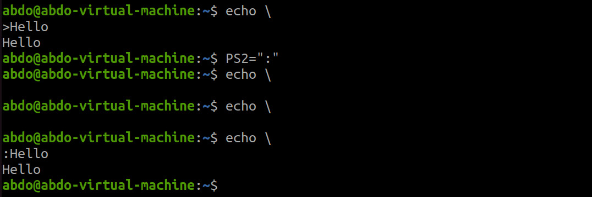

---

If you want me to:
- convert these relative image links to absolute GitHub URLs (so they still render if README is viewed from another branch), tell me which branch to target (for example `main` or `Task3_adminlinux`), and I will update the README with full blob URLs.
- or move all screenshots into a subfolder (e.g., `screenshots/`) and update links accordingly — I can prepare that change and the updated README.

Finished — the README now displays all uploaded screenshots inline so anyone opening the file can see the evidence of the work.
