# Task 7 – Build Cross Compiler using Crosstool-NG

This task explains how to install, configure, and build a cross-compiler toolchain using Crosstool-NG.
Follow the steps below to clone the project, configure it, select your target architecture, and build the final toolchain.


## 📌 1. Clone Crosstool-NG

```shell
git clone https://github.com/crosstool-ng/crosstool-ng
cd crosstool-ng/
```
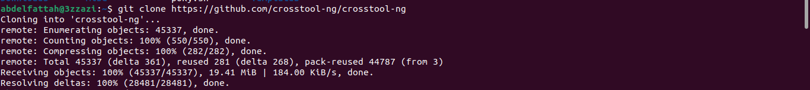

## 📌 2. List available tags and checkout version crosstool-ng-1.26.rc2 

then You’ll need to run the bootstrap script before running configure:
```shell
git tag
git checkout crosstool-ng-1.26.rc2
```
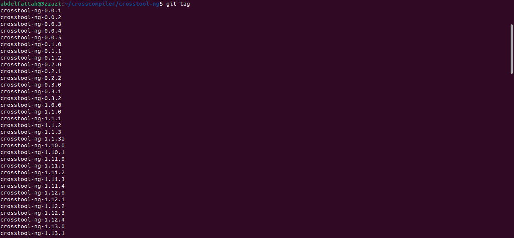
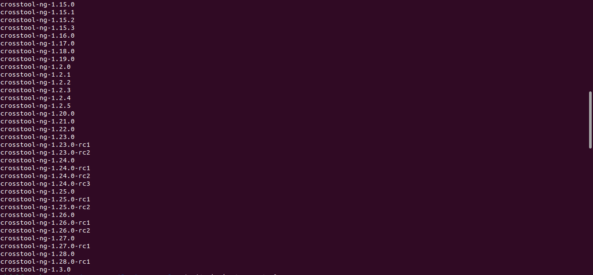
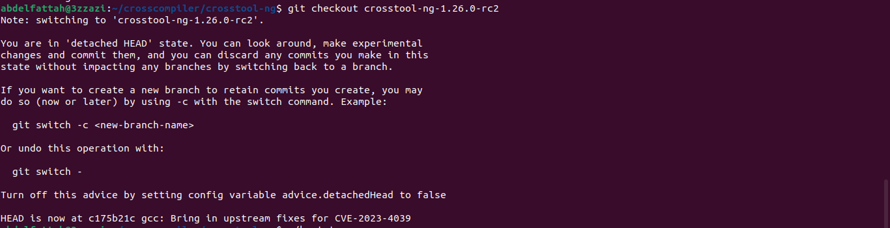


## 📌 3. Run Bootstrap

Before running ./configure, Crosstool-NG requires running the bootstrap script:
```
./bootstrap
```
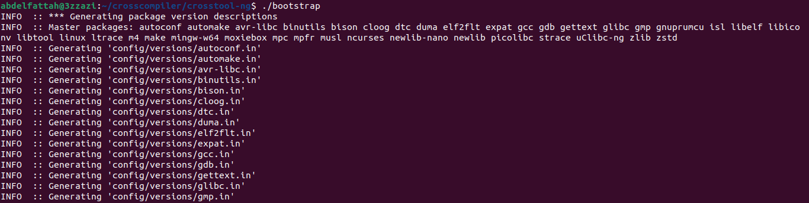
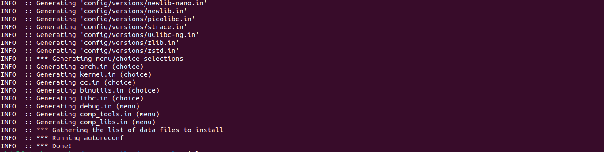

After running bootstrap, the configure file will be generated.

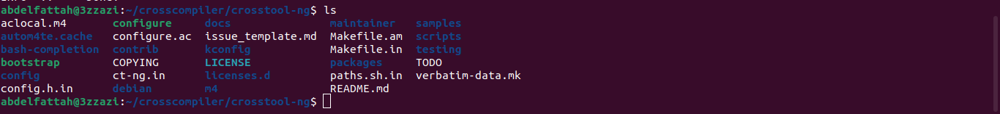

## 📌 4. Configure (Hacker’s Way)

Configure Crosstool-NG in local mode:
```
./configure --enable-local
```
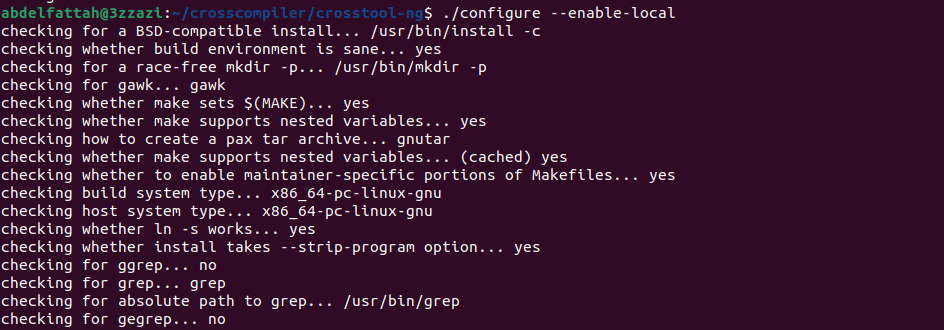

## 📌 5. Build Crosstool-NG

```
make
```

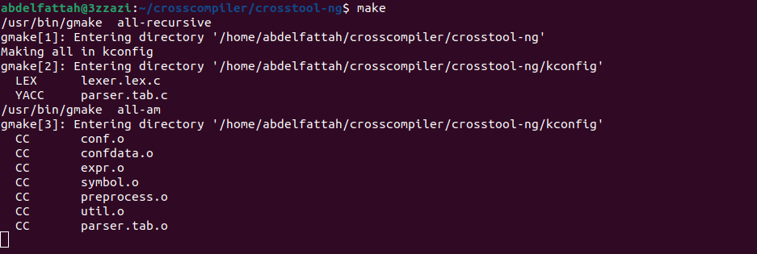

After the build completes, a new executable ct-ng becomes available:

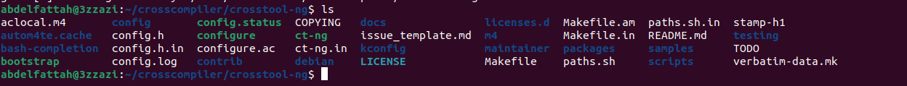

## 📌 6. List Available Toolchain Samples

Use Crosstool-NG to list supported architectures:

```
./ct-ng list-samples
```

To use a sample:

```
./ct-ng <sample-name>
```

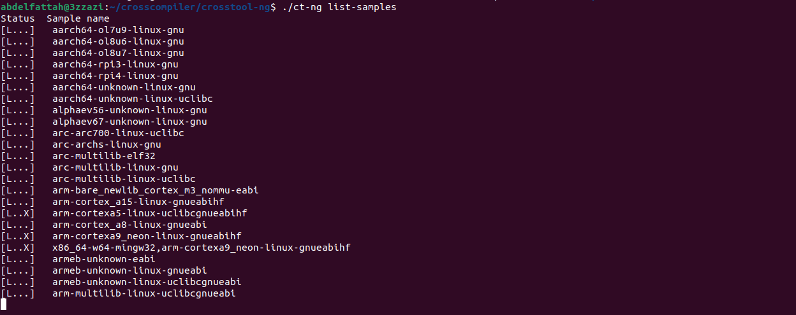
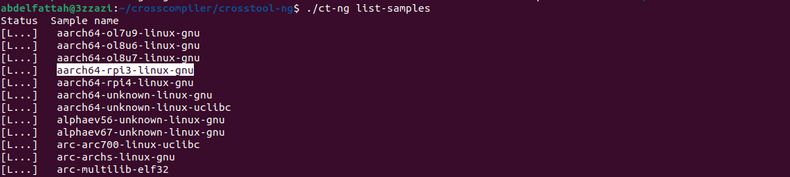

## 📌 7. Build the Toolchain

Start the build:
```
./ct-ng build
```

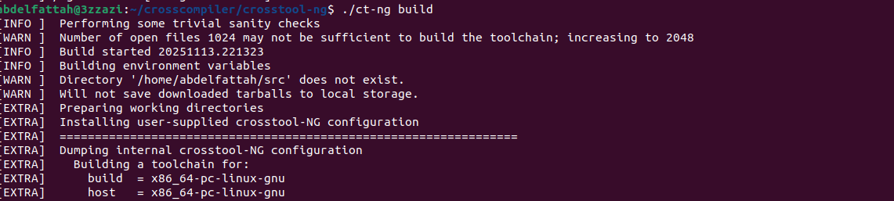


## 📌 8. Toolchain Output

After the build finishes successfully, Crosstool-NG creates a folder in $HOME:
Inside it, you will find your full cross-compiler toolchain:

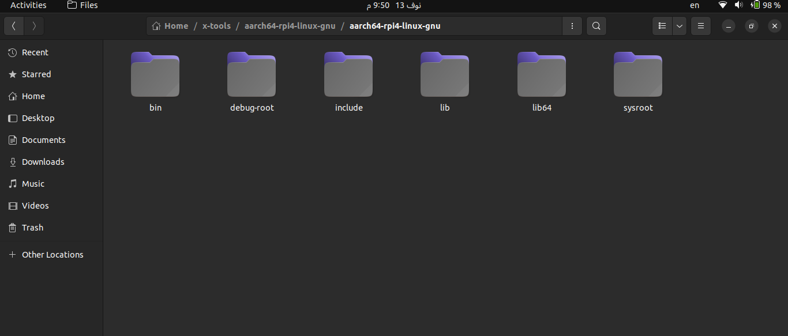
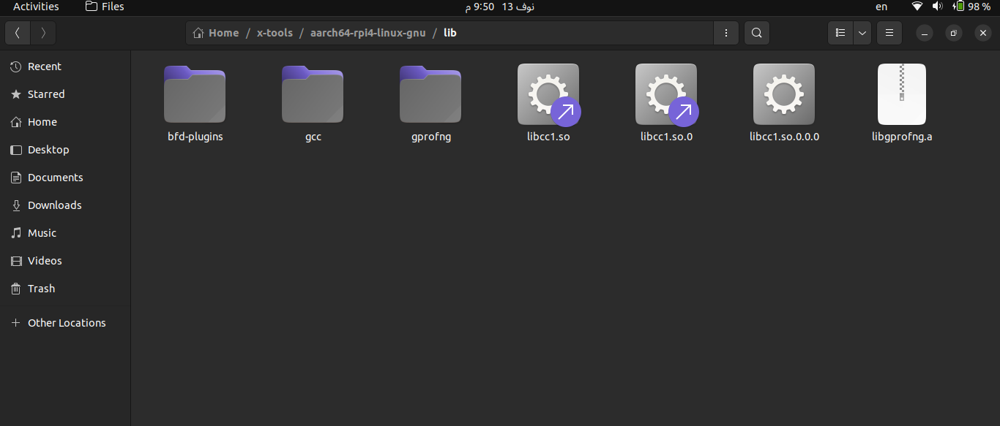


