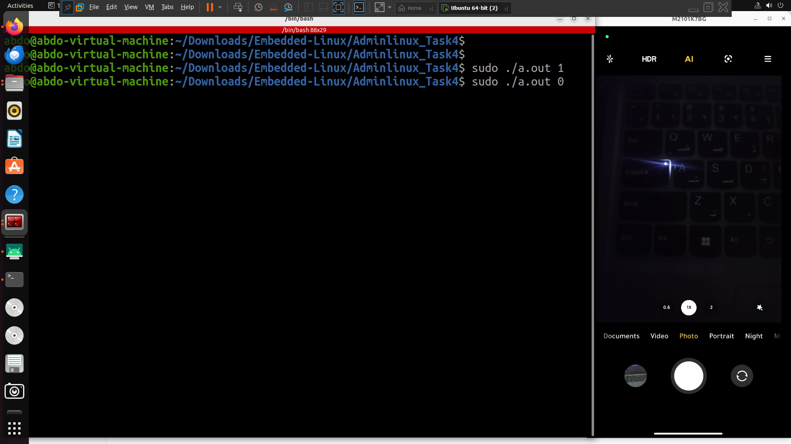

# Admin Linux - Task4
## Toggle Capslock LED via Software

Overview
--------
This directory contains a small C program that toggles the Caps Lock LED by writing to the kernel sysfs brightness file for the Caps Lock LED. The program uses low-level syscalls (open, write, close) to modify the LED brightness node.

Description
-----------
The program expects a brightness value (typically `0` or `1`) and writes that value to the Caps Lock LED brightness sysfs file. Giving the program `1` should turn the Caps Lock LED on, and giving it `0` should turn the Caps Lock LED off. The program performs the write operation using system calls (open, write, close) rather than higher-level stdio functions.

Demo
----
Click the image to open the demo on Google Drive:

