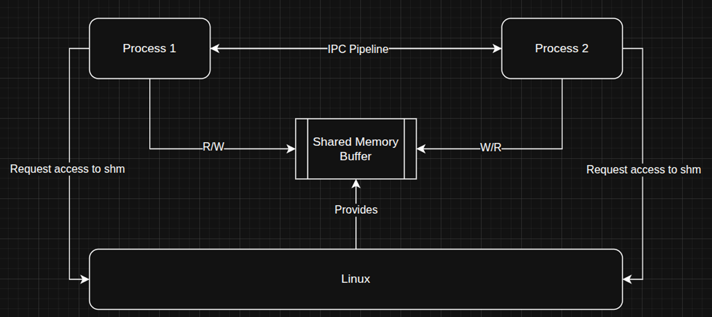
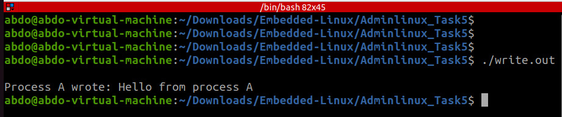
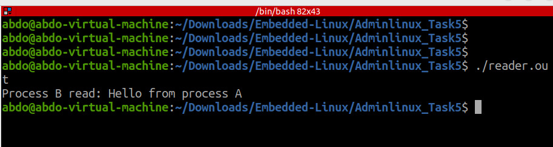

ٌ # Task 5: Inter-Process Communication Via shared Memory

 ## Overview
This task demonstrates simple IPC in Linux using a software shared memory buffer. Two separate C programs are provided:

- `writer` — opens/creates a POSIX shared memory object and writes messages into the shared area.
- `reader` — opens the same shared memory object and reads messages written by the writer.

 ##  Requirements
 - Two applications written in C; each having access to the same software shared memory.
 Screenshots for the 2 processes running and behaving as described

 ## Block Diagram
-  


## Files
- `writer.c` — writes messages to shared memory
- `reader.c` — reads messages from shared memory

## Build
Compile both programs:

```bash
gcc writer.c -o writer  
gcc reader.c -o reader 
```

## Run (example)
Open two terminals.

Terminal B :
```bash
./reader
```

Terminal A (writer):
```bash
./writer

```

## Screenshots
Take two screenshots showing both terminals running simultaneously — one with `reader` waiting/printing and one with `writer` sending messages.

- writer
-  
- reader
- 


## Source code

Below are minimal implementations. Save them as `writer.c` and `reader.c`.


